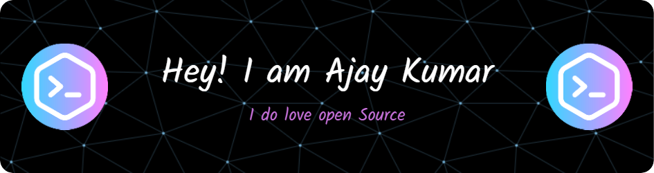

<!-- ********************************************* Header ***************************************************** -->

 

<!-- *********************************************** About me ***************************************************** -->
### About me folks! 

### hi, i'm [Ajay Kumar](https://ajaykumar-dev.netlify.app/), a passionate self-taught MERN stack web developer | freelancer | Passionate Data Engineer | software engineer by Profession from india. my passion for software lies with dreaming up ideas and making them come true with elegant interfaces. I take great care in the experience, architecture, and code quality of the things I build.

### i am also an open-source enthusiast and maintainer. i learned a lot from the open-source community and i love how collaboration and knowledge sharing happened through open-source.

 
  
- ### 💼 Full Stack Software Engineer at [mphasis Limited](https://www.mphasis.com/home.html)
- ### 💬 ask me about anything, i am happy to help;

<!-- *********************************************** Social connect ***************************************************** -->

### 🌍 Connect with me 

<!-- [![Twitter][1.1]][1]  -->
[![LinkedIn][2.1]][2] 
<!-- [![Instagram][3.1]][3] -->

<!-- Icons -->

[2.1]: https://img.icons8.com/color/48/000000/linkedin.png (LinkedIn icon with padding)
<!-- [1.1]: https://img.icons8.com/color/48/000000/twitter--v1.png (twitter icon with padding) -->
<!-- [3.1]: https://img.icons8.com/color/48/000000/instagram-new--v1.png (instagram icon with padding) -->

<!-- Links to your social media accounts -->

[2]: https://www.linkedin.com/in/ajaykumardev/
<!-- [1]: https://twitter.com/# -->
<!-- [3]: https://www.instagram.com/# -->

  

<!-- *********************************************** Technologies used ***************************************************** -->

## 🛠 &nbsp;Tech Stack

- 💻 &nbsp;
  
  
  
  
  

- 🌐 &nbsp;
  
  
  
  
  
  
  
  
  

- 🛢 &nbsp;
  
  
  
  
- ⚙️ &nbsp;
  
  
  

- 🔧 &nbsp;
  
  
  
  
   
   
  

  
- 🔬 &nbsp;
  
  
  

- 📈 &nbsp;
  

 
 

<!-- *********************************************** Github Stats **************************************************** -->

### &#x1f4c8; 📊 GitHub Stats

 
 

 
 
  

<!-- *********************************************** Buy a Coffee for me **************************************************** -->

